---

## 🏛️ Privacy & Regulatory Compliance

### Current Compliance Standards

**🏥 Healthcare Privacy Protection**
- **HIPAA Compliance**: YapChat's agentic memory system meets healthcare privacy and security regulations
- **GDPR Compliance**: Full European data protection and user privacy safeguards

### Future Regulatory Roadmap

**📋 FDA Certification Plans**
- **Digital Therapeutics Pathway**: Pursuing FDA certification for therapeutic applications
- **Clinical Validation**: Developing evidence base for regulatory approval
- **Medical Device Standards**: Aligning Guardian safety system with FDA digital therapeutic requirements

---

## 🚀 Future Guardian Innovationsc and mental health applications, AI safety isn't just about preventing inappropriate content - it's about **protecting lives**. YapChat's Guardian system is designed with the understanding that our AI companions may be the primary support system for vulnerable individuals, including:

- **Mental Health Patients**: People experiencing depression, anxiety, trauma, and crisis situations
- **Vulnerable Adults**: Individuals with cognitive disabilities or in vulnerable life circumstances  
- **Future Pediatric Users**: Children and adolescents requiring specialized protection protocols
- **Crisis Situations**: Users contemplating self-harm or experiencing suicidal ideation
- **Therapeutic Relationships**: Professional healthcare settings requiring clinical-grade safety

**The Stakes**: Our Guardian system doesn't just prevent bad experiences - it prevents harm, protects vulnerable individuals, and ensures therapeutic benefits in every interaction.

---

## 🏗️ Guardian Safety Architecture

### Comprehensive Protection Pipeline

```mermaid
graph TD
    A["💬 User Message Input"] --> B["🛡️ Guardian Safety Engine"]
    B --> C["🔍 Multi-Layer Safety Analysis"]
    
    C --> D["⚡ Injection Guard<br/>(Heuristic + Pattern)"]
    C --> E["🔒 Leakage Guard<br/>(Heuristic + Pattern)"]
    C --> F["☣️ Toxic Content Guard<br/>(LLM Analysis)"]
    C --> G["⚠️ Self-Harm Detection<br/>(Custom Pattern)"]
    C --> H["😰 Hopelessness Detection<br/>(Custom Pattern)"]
    C --> I["👤 PII Protection"]
    C --> J["🔑 Secret Detection"]
    C --> K["🚫 Hate Speech Detection"]
    C --> L["⚖️ Bias Detection"]
    C --> M["🔞 Adult Content Filter"]
    
    D --> N["📊 Safety Score Aggregation"]
    E --> N
    F --> N
    G --> N
    H --> N
    I --> N
    J --> N
    K --> N
    L --> N
    M --> N
    
    N --> O{"🚨 Safety Threshold Check"}
    O -->|Pass| P["✅ Approved for AI Processing"]
    O -->|Fail| Q["🛡️ Safety Intervention"]
    
    P --> R["🤖 AI Personality Response"]
    Q --> S["🏥 Therapeutic Redirect"]
    Q --> T["📞 Crisis Resource Activation"]
    Q --> U["🛡️ Safe Response Generation"]
    
    style B fill:#ff6b6b
    style N fill:#ffd93d
    style O fill:#ff6b6b
    style S fill:#6bcf7f
    style T fill:#ff6b6b
```

### Real-Time Safety Processing

**Server-Side Protection**: Guardian operates server-side during initial message processing, ensuring:
- **Zero User Disruption**: Seamless experience without visible safety interventions
- **Immediate Analysis**: Real-time evaluation of every user input
- **Adaptive Response Generation**: AI output tailored to safety assessment results
- **Continuous Learning**: Safety patterns improve based on interaction data

---

## 🔍 Core Safety Guards Implementation

### Primary Protection Layers

```mermaid
graph LR
    A["🛡️ Guardian Core Guards"] --> B["⚡ Injection Protection"]
    A --> C["🔒 Information Leakage Prevention"]
    A --> D["☣️ Toxic Content Detection"]
    A --> E["⚠️ Self-Harm Prevention"]
    A --> F["😰 Hopelessness Detection"]
    
    B --> B1["Heuristic Analysis<br/>Pattern Matching<br/>Attack Vector Detection"]
    C --> C1["System Prompt Protection<br/>Information Extraction Prevention<br/>Privacy Boundary Enforcement"]
    D --> D1["LLM-Based Analysis<br/>Context-Aware Detection<br/>Therapeutic Sensitivity"]
    E --> E1["Custom Pattern Recognition<br/>Crisis Language Detection<br/>Immediate Intervention"]
    F --> F1["Mental State Assessment<br/>Depression Indicators<br/>Therapeutic Response Triggers"]
    
    style A fill:#ff6b6b
    style B fill:#ffd93d
    style C fill:#74c0fc
    style D fill:#ff8cc8
    style E fill:#ff6b6b
    style F fill:#ff9f43
```

### Enhanced Safety Guard Details

**⚡ Injection Guard (Heuristic + Pattern)**
- **Purpose**: Prevent malicious prompt injection attacks that could compromise AI safety
- **Detection Methods**: Advanced heuristic analysis combined with pattern recognition
- **Therapeutic Importance**: Ensures AI maintains therapeutic boundaries and appropriate responses
- **Protection Scope**: Guards against manipulation attempts that could harm vulnerable users

**🔒 Leakage Guard (Heuristic + Pattern)**  
- **Purpose**: Prevent extraction of system prompts and therapeutic frameworks
- **Detection Methods**: Multi-layered analysis preventing information extraction attempts
- **Healthcare Critical**: Protects proprietary therapeutic approaches and clinical frameworks
- **Privacy Protection**: Ensures user privacy and confidential therapeutic processes

**☣️ Toxic Content Guard (LLM Analysis)**
- **Purpose**: Detect and neutralize harmful, abusive, or inappropriate content
- **Detection Methods**: Advanced LLM-powered analysis for context-aware evaluation
- **Therapeutic Sensitivity**: Specially calibrated for mental health and crisis contexts
- **Vulnerable Population Focus**: Extra protection for users in fragile mental states

**⚠️ Self-Harm Detection (Custom Pattern)**
- **Purpose**: Immediate identification of self-harm ideation or planning
- **Detection Methods**: Custom-developed pattern recognition for crisis language
- **Crisis Response**: Triggers immediate therapeutic intervention protocols
- **Life-Saving Priority**: Highest priority safety measure for user protection

**😰 Hopelessness Detection (Custom Pattern)**
- **Purpose**: Early identification of depressive symptoms and hopelessness indicators
- **Detection Methods**: Specialized pattern analysis for mental health deterioration
- **Preventive Intervention**: Proactive therapeutic support before crisis escalation
- **Therapeutic Integration**: Seamlessly redirects to appropriate mental health resources

---

## 🏥 Therapeutic Safety Protocols

### Mental Health Crisis Response

```mermaid
graph TD
    A["🚨 Crisis Detection Trigger"] --> B["📊 Severity Assessment"]
    B --> C["🔄 Immediate Safety Protocol"]
    
    C --> D["💊 High Risk<br/>(Immediate Danger)"]
    C --> E["⚠️ Medium Risk<br/>(Concerning Patterns)"]
    C --> F["💛 Low Risk<br/>(Preventive Support)"]
    
    D --> G["📞 Crisis Hotline Integration"]
    D --> H["🏥 Emergency Resource Activation"]
    D --> I["👨‍⚕️ Maya Therapist Immediate Response"]
    
    E --> J["🧘 Mindfulness Intervention"]
    E --> K["💪 Coping Strategy Activation"]
    E --> L["📚 Mental Health Resource Provision"]
    
    F --> M["🌱 Wellness Check Escalation"]
    F --> N["📈 Mood Tracking Initiation"]
    F --> O["🤝 Supportive Conversation Redirection"]
    
    G --> P["🔄 Follow-Up Safety Monitoring"]
    H --> P
    I --> P
    J --> P
    K --> P
    L --> P
    M --> P
    N --> P
    O --> P
    
    style A fill:#ff6b6b
    style D fill:#ff4757
    style E fill:#ffa502
    style F fill:#2ed573
    style P fill:#5352ed
```

### Specialized Response Protocols

**🚨 Crisis Intervention Response**
- **Immediate Action**: Direct connection to crisis prevention resources
- **Professional Integration**: Seamless handoff to licensed mental health professionals
- **Safety Prioritization**: User safety takes absolute precedence over conversation flow
- **Resource Activation**: Automatic deployment of appropriate crisis support services

**🧘 Therapeutic Redirection**
- **Maya Integration**: Immediate access to specialized therapeutic AI companion
- **Evidence-Based Interventions**: CBT, DBT, and mindfulness-based immediate responses
- **Personalized Support**: Responses tailored to individual personality profiles
- **Professional Boundaries**: Maintains appropriate therapeutic relationship dynamics

**📚 Resource Provision**
- **Crisis Hotlines**: Immediate access to 24/7 professional support services
- **Local Resources**: Location-based mental health service connections
- **Educational Materials**: Appropriate self-help and coping strategy resources
- **Professional Referrals**: Connections to licensed therapeutic services

---

## 👶 Future Pediatric Safety Framework

### Child Protection Protocols

```mermaid
graph LR
    A["👶 Pediatric Safety Framework"] --> B["🛡️ Enhanced Content Filtering"]
    A --> C["👨‍👩‍👧‍👦 Parental Controls"]
    A --> D["🎓 Educational Safety"]
    A --> E["🚨 Mandatory Reporting Protocols"]
    
    B --> F["Age-Appropriate Content<br/>Stricter Language Controls<br/>Developmental Sensitivity"]
    C --> G["Transparent Monitoring<br/>Conversation Summaries<br/>Safety Alerts"]
    D --> H["Learning-Focused Interactions<br/>Positive Development<br/>Skill Building"]
    E --> I["Abuse Detection<br/>Professional Notification<br/>Child Protection Services"]
    
    style A fill:#74c0fc
    style B fill:#ff8cc8
    style C fill:#51cf66
    style D fill:#ffd43b
    style E fill:#ff6b6b
```

### Pediatric-Specific Safeguards

**🛡️ Enhanced Content Protection**
- **Age-Appropriate Filtering**: Stricter content standards for developing minds
- **Developmental Sensitivity**: Responses calibrated to cognitive and emotional development stages
- **Educational Focus**: Conversations designed to promote positive learning and growth
- **Protective Language**: Careful attention to language impact on young users

**👨‍👩‍👧‍👦 Family Integration**
- **Parental Transparency**: Clear visibility into child's AI interactions
- **Safety Reporting**: Automatic alerts for concerning conversation patterns
- **Family Involvement**: Integration with family support systems and values
- **Professional Coordination**: Seamless connection with pediatric mental health professionals

**🚨 Mandatory Reporting Framework**
- **Abuse Detection**: Advanced recognition of child abuse indicators
- **Professional Notification**: Automatic alerts to appropriate authorities when required
- **Legal Compliance**: Full adherence to mandatory reporting laws and regulations
- **Child Protection Priority**: Absolute prioritization of child safety over privacy

---

## 🔬 Advanced Safety Research & Development

### Continuous Safety Enhancement

```mermaid
graph TD
    A["📊 Real-Time Safety Data"] --> B["🤖 Machine Learning Analysis"]
    B --> C["🔍 Pattern Recognition Enhancement"]
    C --> D["⚙️ Algorithm Refinement"]
    
    D --> E["🛡️ Guard Optimization"]
    D --> F["🎯 Threshold Adjustment"]
    D --> G["🔄 New Threat Detection"]
    D --> H["📈 Performance Improvement"]
    
    E --> I["🔄 Deployed Safety Updates"]
    F --> I
    G --> I
    H --> I
    
    I --> J["📊 Safety Effectiveness Monitoring"]
    J --> K["👥 User Protection Metrics"]
    J --> L["🏥 Therapeutic Outcome Tracking"]
    J --> M["⚠️ Crisis Prevention Success"]
    
    K --> A
    L --> A
    M --> A
    
    style A fill:#74c0fc
    style B fill:#ff8cc8
    style I fill:#51cf66
    style J fill:#ffd43b
```

### Innovative Safety Research

**🤖 AI-Powered Safety Evolution**
- **Conversation Analysis**: Continuous learning from user interactions to improve safety
- **Threat Pattern Recognition**: Evolving detection of new attack vectors and harmful content
- **Therapeutic Effectiveness**: Measuring safety intervention success in mental health contexts
- **Predictive Safety**: Anticipating potential safety issues before they occur

**📊 Safety Effectiveness Metrics**
- **Crisis Prevention Rate**: Measuring successful intervention in potential self-harm situations
- **Therapeutic Alliance Maintenance**: Ensuring safety measures don't disrupt therapeutic relationships
- **False Positive Minimization**: Reducing unnecessary safety interventions while maintaining protection
- **User Trust Preservation**: Maintaining user confidence while providing comprehensive protection

**🔬 Research Applications**
- **Mental Health Safety Research**: Contributing to academic understanding of AI safety in therapeutic contexts
- **Pediatric AI Interaction Studies**: Advancing knowledge of safe AI interaction for children
- **Crisis Prevention Innovation**: Developing new approaches to AI-assisted crisis intervention
- **Vulnerable Population Protection**: Specialized research for protecting at-risk users

---

## 🌐 Integration with YapChat Ecosystem

### Personality-Aware Safety

```mermaid
graph LR
    A["🎭 AI Personality"] --> B["🛡️ Customized Safety Profile"]
    
    A1["👩‍⚕️ Maya - Therapist"] --> B1["Enhanced Crisis Detection<br/>Therapeutic Boundary Enforcement<br/>Professional Ethics Compliance"]
    A2["💪 Marcus - Coach"] --> B2["Motivation Safety Checks<br/>Goal-Setting Appropriateness<br/>Mental Health Awareness"]
    A3["🎭 Zane - Comedian"] --> B3["Humor Appropriateness<br/>Mental State Sensitivity<br/>Comedy Boundary Respect"]
    A4["📚 Elena - Scholar"] --> B4["Educational Appropriateness<br/>Information Accuracy<br/>Learning Safety"]
    
    B1 --> C["🧠 Agentic Memory Integration"]
    B2 --> C
    B3 --> C
    B4 --> C
    
    C --> D["📊 Comprehensive User Protection"]
    
    style A fill:#74c0fc
    style B fill:#ff8cc8
    style C fill:#51cf66
    style D fill:#ffd43b
```

### Memory-Enhanced Safety

**🧠 Agentic Memory Safety Integration**
- **Historical Context**: Safety decisions informed by user's conversation history and mental health patterns
- **Progressive Protection**: Safety measures that evolve based on user's therapeutic progress
- **Crisis Pattern Recognition**: Long-term analysis of user patterns that might indicate developing mental health concerns
- **Therapeutic Continuity**: Ensuring safety interventions support ongoing therapeutic relationships

**🎯 Personality-Specific Protection**
- **Maya (Therapist)**: Enhanced crisis detection, professional boundary enforcement, therapeutic ethics compliance
- **Marcus (Coach)**: Motivation safety checks, appropriate goal-setting, mental health awareness
- **Zane (Comedian)**: Humor appropriateness, mental state sensitivity, comedy boundary respect
- **Custom Personalities**: Safety protocols adapted to each AI companion's role and expertise

---

## 🏛️ Privacy & Regulatory Compliance

### Current Compliance Standards

**🏥 Healthcare Privacy Protection**
- **HIPAA Compliance**: YapChat's agentic memory system meets healthcare privacy and security regulations
- **GDPR Compliance**: Full European data protection and user privacy safeguards

### Future Regulatory Roadmap

**📋 FDA Certification Plans**
- **Digital Therapeutics Pathway**: Pursuing FDA certification for therapeutic applications
- **Clinical Validation**: Developing evidence base for regulatory approval
- **Medical Device Standards**: Aligning Guardian safety system with FDA digital therapeutic requirements

---

## 🚀 Future Guardian Innovations

### Next-Generation Safety Technology

**🔮 Predictive Safety Intelligence**
- **Pre-Crisis Detection**: Identifying mental health deterioration before crisis points
- **Behavioral Pattern Analysis**: Long-term user pattern analysis for proactive intervention
- **Environmental Context Integration**: Considering external factors that might affect user safety
- **Seasonal Mental Health Awareness**: Adjusting safety sensitivity based on known mental health risk periods

**🧬 Biometric Safety Integration**
- **Wearable Device Integration**: Heart rate, stress indicators, sleep patterns informing safety decisions
- **Voice Pattern Analysis**: Emotional state detection through vocal stress indicators
- **Facial Expression Recognition**: Visual cues supplementing text-based safety analysis
- **Physiological Stress Detection**: Multi-modal stress and crisis indicator recognition

### Therapeutic Technology Advancement

**🤖 AI Therapeutic Assistant Evolution**
- **Professional Therapist Collaboration**: AI systems that enhance rather than replace human therapists
- **Personalized Therapeutic Protocols**: Safety measures tailored to individual therapeutic treatment plans
- **Crisis Prevention Automation**: Sophisticated systems for preventing mental health crises
- **Therapeutic Outcome Optimization**: Safety measures that actively support therapeutic goals

**🌍 Global Mental Health Impact**
- **Scalable Crisis Prevention**: AI safety systems that can protect millions of users simultaneously
- **Culturally Responsive Safety**: Safety protocols adapted to different cultural contexts and mental health approaches
- **Accessibility Enhancement**: Making mental health safety available to underserved populations globally
- **Professional Training Integration**: AI safety systems that help train new mental health professionals

---

## 📊 Safety Effectiveness & Validation

### Clinical Validation Research

**🔬 Evidence-Based Safety Validation**
- **Randomized Controlled Trials**: Rigorous testing of Guardian safety effectiveness
- **Long-term Outcome Studies**: Multi-year follow-up of users protected by Guardian systems
- **Comparative Effectiveness Research**: How Guardian-protected interactions compare to traditional therapeutic approaches
- **Crisis Prevention Success Rates**: Quantitative measurement of successful crisis interventions

**📈 Safety Performance Metrics**
- **Crisis Detection Accuracy**: Precision and recall rates for identifying users at risk
- **False Positive Minimization**: Reducing unnecessary safety interventions while maintaining protection
- **User Satisfaction with Safety**: Ensuring protection doesn't negatively impact user experience
- **Therapeutic Alliance Preservation**: Maintaining trust and rapport while providing safety

### Real-World Impact Assessment

**🌟 Life-Saving Success Stories**
- **Crisis Intervention Success**: Documented cases of Guardian system preventing self-harm
- **Early Detection Benefits**: Users who received help before reaching crisis points
- **Therapeutic Outcome Improvement**: Better mental health outcomes due to comprehensive safety
- **Professional Testimonials**: Mental health professionals endorsing Guardian safety effectiveness

---

## 🎯 Why Guardian Changes Everything

### Beyond Traditional AI Safety

**Current AI Safety Limitations:**
- **Generic Protection**: One-size-fits-all safety measures that don't consider individual vulnerability
- **Reactive Approaches**: Safety measures that only respond after harmful content is detected
- **Limited Context**: Safety decisions made without understanding user's mental health state
- **Professional Disconnection**: AI safety systems that don't integrate with healthcare professionals

**YapChat Guardian Advantages:**
- **Vulnerability-Aware Protection**: Safety measures calibrated to individual user risk factors
- **Proactive Intervention**: Preventing crises before they occur through early pattern recognition
- **Therapeutic Integration**: Safety measures that support and enhance therapeutic relationships
- **Professional Collaboration**: Seamless integration with licensed mental health professionals

### The Future of Responsible AI

YapChat's Guardian Safety System represents the evolution from basic content filtering to **comprehensive life protection technology**. By understanding that AI companions may be lifelines for vulnerable individuals, we've created safety measures that don't just prevent bad experiences - they save lives.

Our Guardian system demonstrates that advanced AI safety is not just about preventing misuse - it's about creating technology that actively protects and supports human well-being, especially for those who need it most.

---

**Experience AI safety that truly protects vulnerable populations.**  
Learn more about YapChat: [yap-rwld.vercel.app](https://yap-rwld.vercel.app)

---

## 🤝 YapChat White Label Platform Integration

### Complete Platform Solutions
YapChat's Guardian Safety System is integral to our comprehensive white label platform offering. Organizations receive the entire YapChat protocol including:

**🏥 Healthcare Organizations**
- **Complete Therapeutic Platform**: Full YapChat protocol with integrated Guardian safety for patient care
- **Branded Mental Health Solutions**: White label YapChat platform with organization's branding and clinical protocols
- **Enterprise Safety Compliance**: Guardian system ensuring HIPAA, FDA, and regulatory compliance out-of-the-box
- **Professional Integration**: Seamless fit with existing healthcare workflows and electronic health records

**🎓 Educational Institutions**
- **Campus Mental Health Platform**: Complete YapChat ecosystem for student mental health and crisis prevention
- **Pediatric Safety Implementation**: Guardian system pre-configured for child and adolescent protection
- **Educational Branding**: Institution-branded AI companion platform with comprehensive safety measures
- **Crisis Prevention Network**: Guardian-powered early intervention systems for at-risk students

**🏢 Enterprise Wellness Programs**
- **Employee Mental Health Platform**: White label YapChat with Guardian safety for workplace wellness
- **Corporate Branding Integration**: Complete platform integration with company identity and values
- **Workplace Crisis Prevention**: Guardian system adapted for professional environments and employee support
- **Scalable Safety Architecture**: Enterprise-grade Guardian protection for large employee populations

### White Label Platform Benefits

**🛡️ Comprehensive Safety Included**
- **Guardian System Integration**: Complete safety architecture included in every white label deployment
- **Customizable Safety Protocols**: Guardian system adapted to organization-specific safety requirements
- **Professional Compliance**: Pre-built regulatory compliance for healthcare, education, and enterprise applications
- **Crisis Response Integration**: Guardian safety connected to organization's existing crisis response protocols

**🎨 Complete Platform Customization**
- **Full Branding Control**: Organization's complete visual identity and branding across all platform elements
- **Custom AI Personalities**: Organization-specific AI companions with Guardian safety protection
- **Integration Flexibility**: Guardian system works seamlessly with organization's existing technology stack
- **Scalable Implementation**: Platform grows with organization needs while maintaining comprehensive safety

*Empowering organizations to deploy the world's safest AI companion platform under their own brand.*
