# YapChat - Next-Generation AI Companion Platform

YapChat is an intelligent AI companion platform featuring advanced memory capabilities, dynamic personality management, and revolutionary compatibility matching. Experience natural, meaningful conversations with AI companions that truly understand and remember you to create genuine human connections. 

## 🌟 Experience YapChat Live

Try YapChat today: [yap-rwld.vercel.app](https://yap-rwld.vercel.app)

## ✨ Core Features

### 🎭 21 Unique AI Personalities
- **Instant Access**: Choose from 21 professionally crafted AI personalities
- **Diverse Expertise**: From therapists and coaches to comedians and entrepreneurs
- **Unique Conversations**: Each personality offers distinct communication styles and insights
- **No Setup Required**: Start chatting immediately with any personality

### 🌟 Featured Personalities
- **Zane** - The Stand-Up Comic (entertainment and humor)
- **Maya** - The Therapist (emotional support and guidance)
- **Ruby** - The Entrepreneur (business insights and innovation)
- **Marcus** - The Coach (motivation and goal achievement)
- **Elena** - The Scholar (knowledge and analysis)
- **Leo** - The Fashion Critic (style and sophistication)
- **And 15 more unique personalities...**

### 🎬 Future IP Partnerships
YapChat's 21 starter personalities are just the beginning. Future plans include partnerships to bring licensed personalities from entertainment, gaming, education, and brand collaborations.

### 🧠 Advanced Memory System
- **Perfect Recall**: Your AI companions remember every conversation
- **Contextual Understanding**: Responses based on your complete interaction history
- **Personality Consistency**: Each AI maintains their unique traits across all conversations
- **Seamless Experience**: Switch between personalities while maintaining conversation context

### 🎨 Custom Personality Creation
- **Build Your Own**: Design personalized AI companions with custom traits
- **Unlimited Creativity**: Create companions for any purpose or interest
- **Professional Tools**: Advanced personality design interface
- **Community Sharing**: Share your creations with other users

## 🧬 Revolutionary Personality Profiling

YapChat features breakthrough personality analysis technology that creates comprehensive psychological profiles for authentic human-AI interaction and revolutionary compatibility matching.

### 🎯 How Personality Profiling Works

**Multi-Source Analysis**
- **Natural Conversations**: Every interaction reveals aspects of your unique personality
- **Behavioral Patterns**: Communication style, preferences, and engagement patterns
- **Interest Mapping**: Hobbies, goals, values, and personal preferences
- **Long-term Evolution**: Your profile becomes more accurate over time

**Scientific Foundation**
- **Established Psychology**: Built on decades of personality research
- **Big Five Model**: Industry-standard personality assessment framework
- **RIASEC Interests**: Professional career and interest alignment system
- **Validated Methods**: Used by psychologists and career counselors worldwide

### 📊 Comprehensive Profile Dimensions

**Personality Traits**
- **Openness**: Creativity and openness to new experiences
- **Conscientiousness**: Organization and self-discipline
- **Extraversion**: Social energy and communication style
- **Agreeableness**: Cooperation and interpersonal harmony
- **Emotional Stability**: Stress management and emotional regulation

**Interest Categories**
- **Professional Interests**: Career preferences and work style
- **Personal Dimensions**: Communication style, gaming preferences, values & goals, social preferences

### 🔄 Personality Profiling Journey

```mermaid
graph TD
    A["🗣️ Natural Conversations"] --> B["🧠 LLM Analysis"]
    B --> C["📊 Personality Insights"]
    C --> D["⚖️ Compatibility Matching"]
    
    A1["Chat with AI Companions"] --> B1["Understand Your Style"]
    B1 --> C1["Build Your Profile"]
    C1 --> D1["Find Compatible Matches"]
```

### 🎯 User Experience Flow

### 🎲 Compatibility Matching

**Advanced Matching Algorithm**
- **Multi-Modal Analysis**: Unlike dating apps that focus on preferences, YapChat analyzes actual personality traits, communication patterns, and behavioral data.
- **Scientific Approach**: Based on established psychological research and validated assessment methods
- **Natural Discovery**: No surveys or questionnaires required
- **Deep Compatibility**: Focus on psychological compatibility rather than surface-level preferences

**Matching Philosophy**
- **Authentic Compatibility**: Based on actual personality traits, not just preferences
- **Natural Discovery**: No surveys or questionnaires required
- **Privacy-First**: Anonymized matching protects personal information
- **Meaningful Connections**: Focus on deep psychological compatibility

### ⚡ Key Innovations

1. **Natural Personality Discovery**: No surveys - your personality emerges through normal conversations
2. **AI-Enhanced Analysis**: Sophisticated LLM interprets subtle personality indicators from your communication style
3. **Gaming Integration**: First platform to recognize gaming preferences as legitimate personality indicators
4. **Multi-Dimensional Matching**: Combines personality traits, interests, communication styles, and values
5. **Dynamic Evolution**: Profiles become more accurate as you use the system over time

This personality profiling system represents a breakthrough in understanding human compatibility through natural interaction, moving beyond surface-level preferences to deep psychological compatibility.

## 🎮 Gaming-Enhanced Personality Insights

YapChat revolutionizes personality analysis by recognizing that gaming preferences reveal deep psychological traits. We're the first AI companion platform to integrate gaming data as a legitimate personality indicator.

### 🎯 Why Gaming Matters for Personality

**Gaming as Personality Expression**
- **Strategic vs. Casual**: Reveals problem-solving approaches and planning styles
- **Competitive vs. Cooperative**: Shows social preferences and collaboration styles
- **Story-Driven vs. Action**: Indicates interest in narrative and emotional engagement
- **Solo vs. Multiplayer**: Reflects social energy and preferred interaction styles

**Integration Benefits**
- **Richer Profiles**: Gaming data adds crucial personality dimensions often missed by traditional assessments
- **Authentic Insights**: Gaming behavior reveals authentic preferences in low-pressure environments
- **Broader Understanding**: Captures personality aspects beyond work and social settings
- **Future-Ready**: Positions YapChat for integration with gaming platforms and social networks

## 🎨 AI Persona Creator Economy

YapChat is pioneering the **AI Persona Creator Economy** - a revolutionary platform that empowers users to build, share, and monetize custom AI companions while creating a thriving ecosystem of diverse personalities.

### 🚀 Create Your Own AI Companions

**Custom Persona Creation**
- Design unique AI personalities with custom names, backstories, and behavioral traits
- Leverage our advanced agentic memory system for each persona
- Build companions with specialized expertise, humor styles, or personality types
- Create everything from professional advisors to entertainment-focused companions

**Powered by Advanced Technology**
- **Agentic Memory Integration**: Each custom persona benefits from YapChat's sophisticated memory categorization
- **Personality Consistency**: Personas maintain their unique traits across all conversations
- **Contextual Responses**: Custom companions respond authentically within their designed personality framework
- **Cross-Platform Compatibility**: Share your personas across the entire YapChat ecosystem

### 💰 The Creator Economy Model

**Engagement-Based Revenue Sharing**
- Creators earn a share of platform revenue based on their personas' popularity
- **Transparent Metrics**: Earnings calculated from genuine user engagement (messages sent to your persona)
- **Sustainable Growth**: The more engaging your personas, the more platform usage increases
- **Mutual Benefit**: Creators profit while enhancing the overall user experience

### 💰 Creator Economy Cycle

### 🌟 Creator Program Benefits

**For Creators**
- **Multiple Revenue Streams**: Engagement payments, subscriptions, tips, and brand partnerships
- **Professional Creator Dashboard**: Real-time analytics, earnings tracking, and performance insights
- **Creator Community**: Connect with other successful persona creators and share strategies
- **Marketing Support**: Platform promotion for high-quality, popular personas
- **Creative Freedom**: No restrictions on personality types or specialized niches
- **Intellectual Property Protection**: Your personas remain your creative property

**For Users**
- **Vast Persona Library**: Access thousands of unique AI companions created by the community
- **Quality Assurance**: All personas maintain YapChat's high standards for conversation quality
- **Diverse Experiences**: Find companions tailored to specific interests, professions, or personality types
- **Community-Driven**: Support your favorite creators through natural platform usage
- **Continuous Innovation**: New personas and features driven by community creativity

### 🎯 Launch Strategy

**Phase 1: Creator Tools** *(Current)*
- Advanced persona creation interface
- Personality template system
- Beta creator community establishment

**Phase 2: Revenue Sharing** *(Coming Soon)*
- Engagement tracking implementation
- Creator earnings dashboard
- Transparent revenue distribution system

**Phase 3: Creator Marketplace** *(Future)*
- Featured persona discovery
- Creator spotlight programs
- Advanced monetization options

This Creator Economy represents the future of AI companion development - a collaborative ecosystem where creativity meets technology, and everyone benefits from building better AI relationships.

## 🔮 Future Platform Integrations

YapChat is designed as a comprehensive personality intelligence platform with planned integrations across your digital life:

### 🎮 Gaming Platform Integration
**Automatic Profile Enhancement**
- **Steam Integration**: Sync achievements, playtime, and game library data
- **Console Connectivity**: PlayStation, Xbox, and Nintendo account linking
- **Mobile Gaming**: iOS and Android gaming data integration
- **Achievement Analysis**: Automatic personality insights from gaming accomplishments

### 📱 Social & Lifestyle Integration
**Comprehensive Data Sources**
- **Social Media**: Twitter, Instagram, TikTok interaction pattern analysis
- **Fitness Apps**: Activity levels, workout preferences, and health goals
- **Music Platforms**: Spotify, Apple Music listening habits and mood indicators
- **Calendar Data**: Scheduling patterns, social activity frequency, and time management

### 💼 Professional Development Integration
**Career & Learning Insights**
- **LinkedIn Integration**: Professional interests, career trajectory, and networking style
- **Learning Platforms**: Coursera, Udemy course preferences and learning patterns
- **Productivity Apps**: Work habits, organization styles, and efficiency preferences
- **Team Collaboration**: Slack, Discord communication patterns and leadership style

## 🏥 Wellness & Therapeutic Applications

YapChat's personality intelligence extends beyond social matching into comprehensive wellness and mental health support:

### 🧠 Mental Health Support
**AI-Powered Wellness**
- **Mood Tracking**: Personality-aware emotional state monitoring and pattern recognition
- **Stress Management**: Personalized coping strategies based on individual personality profiles
- **Therapeutic AI Companions**: Specialized personas trained in supportive conversation techniques
- **Crisis Prevention**: Early warning systems for mental health concerns based on communication changes

### 👩‍⚕️ Professional Integration
**Healthcare Collaboration**
- **Therapist Collaboration**: Share anonymized personality insights with mental health professionals
- **Treatment Personalization**: Customize therapeutic approaches based on personality profiles
- **Progress Monitoring**: Track mental health improvements through conversation analysis
- **Resource Matching**: Connect users with therapists whose approaches match their personality types

### 🌱 Wellness Optimization
**Holistic Life Enhancement**
- **Lifestyle Recommendations**: Personality-based suggestions for diet, exercise, and sleep
- **Habit Formation**: Customized behavior change strategies based on individual motivation patterns
- **Social Wellness**: Optimize social interactions and relationship building based on personality compatibility
- **Work-Life Balance**: Personalized strategies for managing stress and maintaining mental health

### 🔬 Research & Development
**Advancing Mental Health Understanding**
- **Anonymized Research**: Contribute to mental health research while maintaining privacy
- **Pattern Recognition**: Identify early indicators of mental health concerns across populations
- **Treatment Effectiveness**: Measure therapeutic intervention success rates across personality types
- **Preventive Care**: Develop proactive mental health strategies based on personality risk factors

## 🌍 The Future of AI Companionship

YapChat represents the next evolution in human-AI interaction:

- **Beyond Chatbots**: Truly intelligent companions that understand and remember
- **Authentic Relationships**: Deep, meaningful connections with AI personalities
- **Personal Growth**: AI companions that help you understand yourself better
- **Community Connection**: Find compatible friendships through AI-mediated matching
- **Creator Economy**: Democratize AI development through community creation
- **Wellness Integration**: Comprehensive mental health and personal development support
- **Global Platform**: Connect people worldwide through personality compatibility

---

## Getting Started

Ready to experience the future of AI companionship?

1. **Visit**: [yap-rwld.vercel.app](https://yap-rwld.vercel.app)
2. **Explore**: Browse 21 unique AI personalities
3. **Connect**: Start conversations with personalities that interest you
4. **Discover**: Let your personality profile develop naturally through conversation
5. **Create**: Design your own custom AI companions
6. **Match**: Find compatible users based on deep personality insights

Join the YapChat community and experience AI companionship that truly understands you.

---

## License

YapChat utilizes open-source technologies and follows industry-standard licensing practices. We're committed to building ethical AI that benefits everyone.
