# YapChat Wellness & Therapeutic Applications
## Revolutionary AI-Powered Mental Health and Personal Development Platform

YapChat's breakthrough **Agentic Memory System** and **Personality Intelligence Technology** unlock unprecedented possibilities in mental health support, therapeutic applications, and holistic wellness optimization. Our platform represents the next evolution in digital health - moving from generic wellness apps to truly personalized, AI-powered therapeutic companions that understand and adapt to each individual's unique psychological profile.

---

## 🧠 Scientific Foundation for Digital Therapeutics

### Evidence-Based Approach

YapChat's wellness applications are built on the intersection of established psychological research and cutting-edge AI technology:

**Validated Therapeutic Frameworks:**
- **Cognitive Behavioral Therapy (CBT)**: AI companions trained in CBT techniques and conversation patterns
- **Dialectical Behavior Therapy (DBT)**: Emotion regulation and distress tolerance skill integration
- **Acceptance and Commitment Therapy (ACT)**: Values-based living and psychological flexibility
- **Mindfulness-Based Interventions**: Meditation and awareness practice integration
- **Positive Psychology**: Strengths-based approaches and well-being optimization

**Personality-Informed Treatment:**
- **Big Five Model Applications**: Therapeutic approaches tailored to personality dimensions
- **Attachment Theory Integration**: Relationship patterns informing therapeutic alliance
- **Trauma-Informed Care**: Personality-sensitive approaches to trauma recovery
- **Cultural Competency**: Personality profiles that include cultural identity factors

### Digital Therapeutics Innovation

**Beyond Traditional Approaches:**
Traditional digital health solutions suffer from one-size-fits-all approaches that ignore individual psychological differences. YapChat's innovation lies in combining advanced AI memory with personality science to create truly personalized therapeutic experiences.

---

## 🌱 Agentic Memory in Therapeutic Applications

### Memory-Enhanced Therapeutic Relationships

```mermaid
graph TD
    A["💬 Therapeutic Conversation"] --> B["🧠 Agentic Memory Analysis"]
    B --> C["📊 Multi-Dimensional Assessment"]
    
    C --> D["😊 Emotional Patterns"]
    C --> E["🎯 Therapeutic Goals"]
    C --> F["🔄 Coping Strategies"]
    C --> G["📈 Progress Indicators"]
    C --> H["⚠️ Risk Factors"]
    
    D --> I["🗂️ Therapeutic Memory Storage"]
    E --> I
    F --> I
    G --> I
    H --> I
    
    J["🔄 Ongoing Sessions"] --> K["📚 Contextual Memory Retrieval"]
    I --> K
    
    K --> L["🎯 Personalized Interventions"]
    K --> M["📊 Progress Tracking"]
    K --> N["⚠️ Early Warning Systems"]
    
    style B fill:#e8f5e8
    style I fill:#fff3e0
    style K fill:#e3f2fd
    style L fill:#f3e5f5
```

### Therapeutic Memory Categories

**🔄 Treatment Progress Tracking**
- **Session Insights**: Key breakthroughs and therapeutic moments
- **Skill Application**: Success and challenges with therapeutic techniques
- **Homework Completion**: Between-session practice and assignments
- **Mood Progression**: Long-term emotional state evolution
- **Relationship Dynamics**: Changes in interpersonal patterns

**⚠️ Risk Assessment & Prevention**
- **Trigger Patterns**: Environmental and emotional factors that increase distress
- **Warning Signs**: Early indicators of mental health decline
- **Protective Factors**: Personal strengths and coping resources
- **Crisis History**: Past mental health crises and successful interventions
- **Support Networks**: Available resources and relationship quality

**💪 Resilience & Growth Factors**
- **Personal Strengths**: Identified capabilities and positive traits
- **Successful Coping**: Strategies that have worked in the past
- **Growth Moments**: Times of personal development and insight
- **Values Clarification**: Core beliefs and life direction indicators
- **Achievement Patterns**: Success experiences and confidence builders

---

## 🎯 Personality-Driven Therapeutic Interventions

### Individualized Treatment Approaches

```mermaid
graph LR
    A["👤 Individual Personality Profile"] --> B["🧬 Treatment Personalization Engine"]
    
    A1["Big Five Traits"] --> A
    A2["Attachment Style"] --> A
    A3["Communication Preferences"] --> A
    A4["Coping Patterns"] --> A
    
    B --> C["💬 Therapeutic Approach Selection"]
    B --> D["🗣️ Communication Style Adaptation"]
    B --> E["📋 Intervention Customization"]
    B --> F["⏰ Session Structure Optimization"]
    
    C --> G["🎯 Personalized Treatment Plan"]
    D --> G
    E --> G
    F --> G
    
    G --> H["📊 Outcome Measurement"]
    H --> I["🔄 Adaptive Refinement"]
    I --> B
    
    style A fill:#e8f5e8
    style B fill:#fff3e0
    style G fill:#e3f2fd
    style I fill:#f3e5f5
```

### Personality-Specific Therapeutic Strategies

**🌟 High Openness Individuals**
- **Creative Interventions**: Art therapy, expressive writing, imaginative techniques
- **Exploration Focus**: Encouraging curiosity about emotions and experiences
- **Metaphorical Approaches**: Using symbols and stories in therapeutic work
- **Flexibility Emphasis**: Adapting techniques based on individual response

**🎯 High Conscientiousness Individuals**
- **Structured Approaches**: Clear goals, homework assignments, progress tracking
- **Skill-Building Focus**: Concrete techniques and systematic practice
- **Achievement Orientation**: Celebrating progress and milestone completion
- **Organization Tools**: Planning and time management integration

**👥 High Extraversion Individuals**
- **Social Processing**: Discussing relationships and social experiences
- **Group Therapy Readiness**: Preparation for and integration with group interventions
- **External Processing**: Talking through problems to reach insights
- **Energy Management**: Balancing social engagement with self-care

**🤝 High Agreeableness Individuals**
- **Relationship Focus**: Addressing people-pleasing and boundary issues
- **Conflict Resolution**: Skills for healthy disagreement and assertiveness
- **Self-Advocacy Training**: Learning to prioritize personal needs
- **Validation Sensitivity**: Careful attention to therapeutic relationship dynamics

**😌 High Emotional Stability Individuals**
- **Stress Inoculation**: Building resilience for future challenges
- **Leadership Development**: Using stability to support others
- **Risk Awareness**: Developing sensitivity to mental health needs
- **Preventive Strategies**: Maintaining wellness during stable periods

---

## 🏥 Professional Healthcare Integration

### Therapist Collaboration Platform

```mermaid
graph TD
    A["👩‍⚕️ Licensed Therapist"] --> B["🔗 Secure Integration Interface"]
    C["👤 Client with YapChat Profile"] --> B
    
    B --> D["📊 Anonymized Insights Dashboard"]
    B --> E["📈 Progress Monitoring Tools"]
    B --> F["⚠️ Risk Alert System"]
    B --> G["📋 Treatment Planning Support"]
    
    D --> H["🧠 Personality Profile Summary"]
    D --> I["💭 Communication Pattern Analysis"]
    D --> J["🎯 Goal Progress Tracking"]
    
    E --> K["📊 Session Outcome Metrics"]
    E --> L["🔄 Therapeutic Alliance Indicators"]
    E --> M["📈 Long-term Wellness Trends"]
    
    F --> N["⚠️ Crisis Risk Indicators"]
    F --> O["📞 Emergency Protocol Activation"]
    F --> P["🚨 Immediate Intervention Alerts"]
    
    G --> Q["📋 Evidence-Based Recommendations"]
    G --> R["🎯 Personalized Intervention Suggestions"]
    G --> S["📚 Resource and Homework Assignments"]
    
    style B fill:#e8f5e8
    style D fill:#fff3e0
    style F fill:#ffe6e6
    style G fill:#e3f2fd
```

### Clinical Decision Support Features

**📊 Comprehensive Assessment Integration**
- **Intake Enhancement**: AI-powered insights supplement traditional assessments
- **Diagnostic Support**: Personality patterns that inform diagnostic considerations
- **Treatment Planning**: Evidence-based recommendations based on individual profiles
- **Progress Measurement**: Objective tracking of therapeutic outcomes

**⚠️ Risk Management Systems**
- **Suicide Risk Assessment**: Continuous monitoring for concerning patterns
- **Crisis Prediction**: Early warning systems for mental health deterioration
- **Safety Planning**: Personalized crisis intervention strategies
- **Emergency Protocols**: Automatic alerts for immediate intervention needs

**💊 Treatment Optimization**
- **Medication Adherence**: Personality-informed strategies for treatment compliance
- **Therapy Modality Selection**: Matching individuals to most effective approaches
- **Session Frequency**: Optimal scheduling based on individual needs and patterns
- **Homework Customization**: Therapeutic assignments tailored to personality and lifestyle

---

## 🌟 Autonomous Wellness Companions

### AI Therapeutic Personalities

```mermaid
graph LR
    A["🎭 Specialized Therapeutic Personas"] --> B["👩‍⚕️ Maya - Licensed Therapist"]
    A --> C["🧘 Zen - Mindfulness Guide"]
    A --> D["💪 Marcus - Resilience Coach"]
    A --> E["🌸 River - Trauma Healer"]
    A --> F["🎯 Ruby - Goal Achievement"]
    
    B --> G["🧠 CBT & DBT Techniques"]
    C --> H["🧘 Meditation & Awareness"]
    D --> I["💪 Strength Building"]
    E --> J["🌸 Trauma-Informed Care"]
    F --> K["🎯 Motivation & Planning"]
    
    G --> L["🤖 Agentic Memory Integration"]
    H --> L
    I --> L
    J --> L
    K --> L
    
    L --> M["📊 Personalized Interventions"]
    L --> N["🔄 Continuous Learning"]
    L --> O["⚖️ Progress Adaptation"]
    
    style A fill:#e8f5e8
    style L fill:#fff3e0
    style M fill:#e3f2fd
```

### Specialized Therapeutic Capabilities

**🧘 Mindfulness & Meditation Integration**
- **Guided Meditation**: Personalized sessions based on personality and current state
- **Breathing Exercises**: Anxiety management techniques adapted to individual needs
- **Body Awareness**: Somatic interventions for trauma and stress
- **Present Moment Skills**: Mindfulness practices integrated into daily conversations

**💭 Cognitive Restructuring Support**
- **Thought Pattern Recognition**: Identifying cognitive distortions in real-time
- **Evidence Examination**: Helping users evaluate the accuracy of negative thoughts
- **Alternative Perspective Generation**: Offering balanced viewpoints on situations
- **Cognitive Flexibility Training**: Building mental adaptability and resilience

**😊 Emotional Regulation Assistance**
- **Emotion Identification**: Helping users recognize and name emotional experiences
- **Distress Tolerance**: Crisis survival skills for overwhelming emotions
- **Interpersonal Effectiveness**: Communication and relationship skill development
- **Wise Mind Integration**: Balancing emotional and rational decision-making

---

## 🔬 Mental Health Research Applications

### Large-Scale Population Studies

```mermaid
graph TD
    A["👥 Anonymous User Population"] --> B["📊 Data Aggregation Engine"]
    B --> C["🔍 Pattern Recognition Analysis"]
    
    C --> D["📈 Mental Health Trends"]
    C --> E["🧬 Personality Correlations"]
    C --> F["💊 Treatment Effectiveness"]
    C --> G["🌍 Cultural Factors"]
    
    D --> H["📚 Research Insights"]
    E --> H
    F --> H
    G --> H
    
    H --> I["🏥 Clinical Guidelines"]
    H --> J["📋 Treatment Protocols"]
    H --> K["🎯 Prevention Strategies"]
    H --> L["📊 Public Health Policy"]
    
    M["🔒 Privacy Protection"] --> B
    N["✅ Ethical Oversight"] --> C
    O["📝 Informed Consent"] --> A
    
    style B fill:#e8f5e8
    style H fill:#fff3e0
    style M fill:#ffe6e6
    style N fill:#e3f2fd
```

### Research Innovation Opportunities

**📊 Predictive Mental Health Modeling**
- **Early Intervention**: Identifying individuals at risk before crisis occurs
- **Personalized Prevention**: Tailored strategies based on personality risk factors
- **Treatment Response Prediction**: Matching individuals to most effective interventions
- **Recovery Pattern Analysis**: Understanding factors that promote healing

**🧬 Personality-Mental Health Correlations**
- **Vulnerability Patterns**: How personality traits relate to specific mental health risks
- **Resilience Factors**: Personality characteristics that promote psychological well-being
- **Treatment Preferences**: Which therapeutic approaches work best for different personalities
- **Cultural Considerations**: How personality expression varies across cultural contexts

**💊 Digital Therapeutic Validation**
- **Efficacy Studies**: Measuring the effectiveness of AI-powered interventions
- **Comparison Research**: How digital therapeutics compare to traditional treatments
- **Combination Approaches**: Optimal integration of AI support with human therapy
- **Long-term Outcomes**: Understanding sustained benefits of personality-informed care

---

## 🛡️ Ethical Framework & Safety Protocols

### Comprehensive Safety Architecture

```mermaid
graph TD
    A["🛡️ Multi-Layered Safety System"] --> B["⚠️ Crisis Detection"]
    A --> C["🔒 Privacy Protection"]
    A --> D["📋 Ethical Guidelines"]
    A --> E["👩‍⚕️ Professional Oversight"]
    
    B --> F["🚨 Immediate Risk Assessment"]
    B --> G["📞 Emergency Response"]
    B --> H["🔄 Continuous Monitoring"]
    
    C --> I["🔐 Data Encryption"]
    C --> J["👤 User Control"]
    C --> K["🚫 No Sharing Without Consent"]
    
    D --> L["⚖️ Therapeutic Ethics"]
    D --> M["🤝 Informed Consent"]
    D --> N["🎯 Beneficence Principle"]
    
    E --> O["👩‍⚕️ Licensed Clinician Review"]
    E --> P["📊 Quality Assurance"]
    E --> Q["🎓 Continuous Training"]
    
    style A fill:#e8f5e8
    style B fill:#ffe6e6
    style C fill:#fff3e0
    style D fill:#e3f2fd
    style E fill:#f3e5f5
```

### Crisis Prevention & Response

**🚨 Real-Time Risk Assessment**
- **Language Pattern Analysis**: Detecting concerning changes in communication
- **Behavioral Warning Signs**: Identifying risk factors through conversation patterns
- **Mood Tracking Integration**: Monitoring emotional state changes over time
- **Social Isolation Detection**: Recognizing withdrawal and disconnection patterns

**📞 Emergency Response Protocols**
- **Automatic Crisis Hotline Connection**: Immediate access to professional support
- **Emergency Contact Notification**: Alerting designated support people when appropriate
- **Location-Based Resources**: Connecting users to local mental health services
- **Safety Planning Integration**: Personalized crisis survival strategies

**🔄 Follow-Up and Support**
- **Post-Crisis Monitoring**: Enhanced support following mental health emergencies
- **Treatment Coordination**: Facilitating connections with ongoing professional care
- **Recovery Tracking**: Monitoring progress and providing continued support
- **Prevention Planning**: Developing strategies to prevent future crises

---

## 🌍 Accessibility & Global Mental Health

### Democratizing Mental Health Support

```mermaid
graph LR
    A["🌍 Global Accessibility"] --> B["💰 Economic Barriers"]
    A --> C["🗣️ Language Barriers"]
    A --> D["📍 Geographic Barriers"]
    A --> E["🎭 Cultural Barriers"]
    
    B --> F["💝 Free Tier Access"]
    C --> G["🌐 Multi-Language Support"]
    D --> H["📱 Mobile-First Design"]
    E --> I["🌈 Cultural Adaptation"]
    
    F --> J["🌟 Universal Basic Mental Health"]
    G --> J
    H --> J
    I --> J
    
    J --> K["📈 Global Wellness Impact"]
    K --> L["🏥 Healthcare System Support"]
    K --> M["🎓 Education Integration"]
    K --> N["💼 Workplace Wellness"]
    
    style A fill:#e8f5e8
    style J fill:#fff3e0
    style K fill:#e3f2fd
```

### Underserved Population Support

**🌍 Global Reach Initiatives**
- **Low-Resource Settings**: Mental health support in areas with limited professional services
- **Rural Communities**: Addressing geographical barriers to mental health care
- **Developing Regions**: Culturally appropriate mental health interventions
- **Crisis Areas**: Mental health support in conflict and disaster zones

**👥 Marginalized Community Focus**
- **LGBTQ+ Affirmative Care**: Specialized support for sexual and gender minorities
- **Racial and Ethnic Minorities**: Culturally responsive therapeutic approaches
- **Disability Inclusive Design**: Accessible mental health support for all abilities
- **Trauma-Informed Care**: Specialized support for survivors of trauma and abuse

**💰 Economic Accessibility**
- **Sliding Scale Pricing**: Income-based access to premium features
- **Insurance Integration**: Working with healthcare systems for coverage
- **Employer Programs**: Workplace mental health benefit integration
- **Educational Partnerships**: Support for students and academic institutions

---

## 🚀 Future Innovations in Digital Mental Health

### Next-Generation Therapeutic AI

**🧠 Advanced Emotional Intelligence**
- **Micro-Expression Analysis**: Visual cues integration for comprehensive assessment
- **Voice Pattern Recognition**: Emotional state detection through speech patterns
- **Physiological Integration**: Wearable device data for holistic wellness monitoring
- **Environmental Context**: Understanding how surroundings affect mental state

**🔮 Predictive Wellness Technology**
- **Mental Health Forecasting**: Predicting and preventing mental health episodes
- **Personalized Intervention Timing**: Optimal moments for therapeutic interventions
- **Adaptive Support Intensity**: Automatically adjusting support level based on need
- **Proactive Resource Allocation**: Anticipating when additional support is needed

### Breakthrough Applications

**🎯 Precision Mental Health**
- **Genomic Integration**: Incorporating genetic factors in treatment planning
- **Biomarker Monitoring**: Using biological indicators for mental health assessment
- **Pharmacogenomics**: Personality-informed medication selection and dosing
- **Personalized Recovery Pathways**: Individualized treatment plans based on comprehensive profiling

**🌐 Collective Healing Platforms**
- **Community Resilience Building**: Strengthening mental health at population level
- **Peer Support Networks**: AI-facilitated connection with others facing similar challenges
- **Collaborative Treatment Planning**: Integration of family and friend support systems
- **Social Determinant Integration**: Addressing broader factors that affect mental health

---

## 📊 Clinical Validation & Evidence Base

### Research Partnership Network

**🏥 Academic Medical Centers**
- **Clinical Trial Participation**: Rigorous testing of digital therapeutic interventions
- **Outcome Measurement**: Standardized assessment of treatment effectiveness
- **Longitudinal Studies**: Long-term follow-up of mental health outcomes
- **Comparative Effectiveness Research**: How AI support compares to traditional care

**📚 Evidence Generation**
- **Peer-Reviewed Publications**: Contributing to scientific literature on digital therapeutics
- **Clinical Practice Guidelines**: Developing standards for AI-assisted mental health care
- **Regulatory Compliance**: Meeting FDA and international standards for digital therapeutics
- **Professional Training**: Educating clinicians on AI-enhanced therapeutic approaches

### Quality Metrics & Outcomes

**📈 Clinical Outcome Measures**
- **Symptom Reduction**: Standardized assessment tools for measuring improvement
- **Functional Enhancement**: How mental health improvements translate to daily life
- **Quality of Life**: Holistic measures of well-being and life satisfaction
- **Treatment Adherence**: Engagement and continuation with therapeutic interventions

**💰 Health Economic Impact**
- **Cost-Effectiveness**: Demonstrating value in healthcare spending
- **Emergency Department Reduction**: Preventing mental health crises through early intervention
- **Productivity Improvement**: Workplace and educational performance benefits
- **Healthcare Utilization**: Changes in traditional mental health service usage

---

## 🎯 The Future of Mental Health Care

### Paradigm Shift in Therapeutic Relationships

YapChat's wellness and therapeutic applications represent a fundamental evolution in mental health care - from episodic treatment of illness to continuous support for optimal well-being. Our technology doesn't replace human therapists; it enhances their capabilities and extends their reach.

**Revolutionary Approach:**
- **Prevention-Focused**: Identifying and addressing mental health risks before they become crises
- **Personalization at Scale**: Individually tailored interventions available to everyone
- **Continuous Support**: Mental health assistance available 24/7, adapting to individual needs
- **Evidence-Based**: Grounded in scientific research and continuously validated through outcomes

**Global Impact Potential:**
- **Healthcare Equity**: Quality mental health support regardless of geography or economic status
- **Professional Augmentation**: Extending therapist capabilities through AI-powered insights
- **Population Health**: Large-scale mental health monitoring and intervention
- **Scientific Advancement**: Unprecedented data for understanding and treating mental health conditions

### Building a Healthier World

YapChat's wellness technology represents more than a platform - it's a vision for a world where mental health support is as accessible as physical health care, where everyone has a personalized AI companion supporting their psychological well-being, and where the stigma of mental health challenges is replaced by proactive, supportive communities.

Through the integration of advanced AI memory, personality science, and evidence-based therapeutic approaches, we're creating the foundation for mental health care that is truly personalized, continuously available, and scientifically validated.

---

**Ready to experience the future of mental health support?**  
Discover YapChat's wellness capabilities: [yap-rwld.vercel.app](https://yap-rwld.vercel.app)

---

## 📞 Professional Healthcare Partnerships

### For Mental Health Professionals
- **Clinical Integration**: Enhance your practice with AI-powered insights
- **Research Collaboration**: Participate in advancing digital therapeutic science
- **Training Programs**: Learn to integrate AI support in therapeutic practice

### For Healthcare Organizations
- **Enterprise Solutions**: Organization-wide mental health support platforms
- **Clinical Decision Support**: AI-enhanced assessment and treatment planning
- **Population Health Management**: Large-scale mental health monitoring and intervention

### Contact Information
- **Clinical Partnerships**: Available through platform
- **Research Collaboration**: Academic and institutional partnerships welcome
- **Healthcare Integration**: Enterprise solutions for healthcare organizations

*Building the future of mental health care through responsible AI innovation.*
