# YapChat Agentic Memory System
## Revolutionary AI Memory Architecture for Intelligent Conversations

YapChat has developed the world's first **Agentic Memory System** - a breakthrough in AI memory architecture that transforms how artificial intelligence remembers, learns, and adapts to human users. Unlike traditional AI systems that store conversations linearly, our agentic memory behaves like human memory: intelligent, contextual, and continuously evolving.

---

## 🧠 What Makes Memory "Agentic"

### Traditional AI Memory Limitations

Most AI systems today use primitive memory approaches that severely limit their ability to provide meaningful, personalized experiences:

**Linear Storage Problems:**
- **Chronological Only**: Conversations saved in time order without meaningful organization
- **No Context Understanding**: Can't distinguish between important and trivial information
- **Keyword Dependence**: Relies on exact word matching rather than conceptual understanding
- **Information Overload**: Important details get buried in conversation history
- **No Learning**: Past interactions don't improve future conversations

**The Result**: Repetitive, generic interactions that feel robotic and impersonal.

### YapChat's Agentic Solution

Our agentic memory system fundamentally reimagines how AI should remember and learn:

**Intelligent Organization:**
- **Semantic Categorization**: Automatically sorts information by meaning and importance
- **Contextual Relationships**: Understands how different memories connect to each other
- **Adaptive Prioritization**: Learns what information matters most to each user
- **Dynamic Retrieval**: Finds relevant memories based on current conversation context

**The Result**: Natural, personalized conversations that improve over time.

---

## 🏗️ Agentic Memory Architecture

### Core System Design

```mermaid
graph TD
    A["💬 User Input"] --> B["🔍 Real-Time Analysis Engine"]
    B --> C["📊 Contextual Understanding"]
    C --> D["🏷️ Intelligent Categorization"]
    
    D --> E["💭 Personal Values"]
    D --> F["🎯 Goals & Aspirations"]
    D --> G["🗣️ Communication Style"]
    D --> H["🎨 Interests & Hobbies"]
    D --> I["📚 Life Experiences"]
    D --> J["🤝 Relationship Patterns"]
    D --> K["📈 Behavioral Insights"]
    
    E --> L["🗄️ Structured Memory Storage"]
    F --> L
    G --> L
    H --> L
    I --> L
    J --> L
    K --> L
    
    M["💬 New Conversation"] --> N["🧠 Context Analysis"]
    N --> O["📚 Memory Retrieval Engine"]
    L --> O
    
    O --> P["⚖️ Relevance Scoring"]
    P --> Q["🔗 Memory Integration"]
    Q --> R["✨ Contextual Response"]
    Q --> S["📊 Memory Updates"]
    
    style B fill:#e8f5e8
    style O fill:#fff3e0
    style Q fill:#e3f2fd
    style S fill:#f3e5f5
```

### Memory Processing Pipeline

**1. Input Analysis**
- **Natural Language Processing**: Understands the meaning behind user's words
- **Emotional Context Detection**: Recognizes mood, sentiment, and emotional state
- **Intent Recognition**: Identifies what the user is trying to accomplish
- **Relationship Mapping**: Connects new information to existing memories

**2. Intelligent Categorization**
- **Semantic Analysis**: Groups related concepts together
- **Importance Weighting**: Determines the significance of new information
- **Temporal Context**: Understands when information is relevant
- **Personal Relevance**: Assesses how information relates to the user's life

**3. Contextual Storage**
- **Multi-Dimensional Indexing**: Stores memories with multiple access points
- **Relationship Networks**: Creates connections between related memories
- **Metadata Enrichment**: Adds context tags for better retrieval
- **Compression & Synthesis**: Combines related information efficiently

---

## 📁 Memory Categories & Organization

### Core Memory Types

```mermaid
graph LR
    A["🧠 Agentic Memory Core"] --> B["💭 Personal Values"]
    A --> C["🎯 Goals & Dreams"]
    A --> D["🗣️ Communication Style"]
    A --> E["🎨 Interests & Passions"]
    A --> F["📖 Life Experiences"]
    A --> G["🤝 Relationships"]
    A --> H["📈 Behavioral Patterns"]
    
    B --> B1["Moral frameworks<br/>Core beliefs<br/>Decision principles"]
    C --> C1["Career aspirations<br/>Personal goals<br/>Life vision"]
    D --> D1["Conversation preferences<br/>Humor style<br/>Emotional expression"]
    E --> E1["Hobbies & activities<br/>Learning interests<br/>Entertainment choices"]
    F --> F1["Significant events<br/>Travel experiences<br/>Personal stories"]
    G --> G1["Family dynamics<br/>Friendship patterns<br/>Social preferences"]
    H --> H1["Routine patterns<br/>Decision-making style<br/>Growth trends"]
    
    style A fill:#e8f5e8
    style B fill:#fff3e0
    style C fill:#e3f2fd
    style D fill:#f3e5f5
    style E fill:#fce4ec
    style F fill:#e8f4f8
    style G fill:#f1f8e9
    style H fill:#fff8e1
```

### Detailed Memory Categories

**💭 Personal Values & Beliefs**
- **Core Principles**: Fundamental beliefs that guide decision-making
- **Moral Framework**: Ethical stances and value judgments
- **Life Philosophy**: Worldview and perspective on existence
- **Cultural Identity**: Background, traditions, and cultural influences
- **Spiritual Beliefs**: Religious or philosophical spiritual perspectives

**🎯 Goals & Aspirations**
- **Career Objectives**: Professional ambitions and development goals
- **Personal Growth**: Self-improvement targets and learning goals
- **Life Milestones**: Major life events and achievement targets
- **Creative Pursuits**: Artistic and creative aspirations
- **Relationship Goals**: Desired relationship outcomes and family plans

**🗣️ Communication Preferences**
- **Conversation Style**: Preferred topics, depth, and interaction patterns
- **Humor & Wit**: Comedy preferences and joke styles
- **Emotional Expression**: How feelings are shared and processed
- **Conflict Resolution**: Approaches to disagreement and problem-solving
- **Social Boundaries**: Communication limits and comfort zones

**🎨 Interests & Passions**
- **Hobbies & Activities**: Regular interests and recreational pursuits
- **Learning Interests**: Subjects of curiosity and study
- **Entertainment Preferences**: Movies, music, books, and media choices
- **Lifestyle Choices**: Daily routines, habits, and life approach
- **Creative Expression**: Artistic outlets and creative activities

**📖 Life Experiences**
- **Significant Events**: Major life moments and turning points
- **Travel & Adventure**: Places visited and cultural experiences
- **Professional Journey**: Career progression and work experiences
- **Personal Stories**: Memorable anecdotes and meaningful moments
- **Challenges Overcome**: Difficulties faced and lessons learned

---

## 🔍 Intelligent Memory Retrieval

### Advanced Retrieval System

```mermaid
graph TD
    A["💬 Current Conversation Context"] --> B["🔍 Multi-Dimensional Analysis"]
    
    B --> C["🎯 Direct Topic Match"]
    B --> D["🔗 Conceptual Relationships"]
    B --> E["😊 Emotional Resonance"]
    B --> F["⏰ Temporal Relevance"]
    B --> G["👤 Personal Significance"]
    
    C --> H["📊 Relevance Scoring Engine"]
    D --> H
    E --> H
    F --> H
    G --> H
    
    H --> I["🏆 High Priority<br/>(90-100% relevance)"]
    H --> J["📈 Medium Priority<br/>(60-89% relevance)"]
    H --> K["💡 Low Priority<br/>(30-59% relevance)"]
    
    I --> L["🧠 Memory Integration"]
    J --> L
    K --> L
    
    L --> M["⚖️ Context Weighting"]
    M --> N["✨ Response Enhancement"]
    M --> O["📚 Learning Updates"]
    
    style B fill:#e8f5e8
    style H fill:#fff3e0
    style L fill:#e3f2fd
    style N fill:#f3e5f5
```

### Smart Retrieval Features

**🎯 Contextual Relevance Scoring**
- **Topic Alignment**: How well memories match current conversation themes
- **Semantic Similarity**: Conceptual relationships beyond keyword matching
- **User Intent Understanding**: Memories that help accomplish current goals
- **Conversation Flow**: Information that naturally fits the discussion

**😊 Emotional Context Awareness**
- **Mood Detection**: Understanding the user's current emotional state
- **Emotional Memory Matching**: Surfacing memories with similar emotional content
- **Supportive Recall**: Retrieving encouraging memories during difficult times
- **Celebratory Connections**: Highlighting positive memories during good times

**⏰ Temporal Intelligence**
- **Recency Bias**: Prioritizing recent memories for immediate relevance
- **Historical Significance**: Surfacing older memories when contextually important
- **Seasonal Patterns**: Recognizing time-based relevance (holidays, anniversaries)
- **Growth Tracking**: Comparing past and present perspectives

**🔗 Associative Learning**
- **Chain Reactions**: Following memory connections through related concepts
- **Pattern Recognition**: Identifying recurring themes and behaviors
- **Narrative Building**: Creating coherent stories from memory fragments
- **Insight Generation**: Discovering new connections between experiences

---

## 🔐 Privacy & Security Architecture

### Advanced Security Measures

**🛡️ Memory Isolation Technology**
- **User Separation**: Complete isolation of each user's memory space
- **Encryption at Rest**: All stored memories encrypted with user-specific keys
- **Access Controls**: Multi-layered permission systems for memory access
- **Audit Trails**: Complete logging of all memory access and modifications

**👤 User Control & Transparency**
- **Memory Visibility**: Users can view all stored memories and categories
- **Selective Deletion**: Granular control over which memories to keep or remove
- **Sharing Permissions**: Explicit consent for using memories in matching algorithms
- **Data Export**: Complete memory archives available for user download

**🔒 Technical Safeguards**
- **Cross-Contamination Prevention**: Technical barriers preventing memory mixing
- **Anonymous Processing**: Personality analysis uses anonymized patterns
- **Regular Security Audits**: Continuous monitoring for vulnerabilities
- **Compliance Standards**: GDPR, CCPA, and other privacy regulation adherence

---

## 🚀 Advanced Applications

### Personalized AI Interactions

**🎨 Dynamic Personality Adaptation**
- **Communication Style Matching**: AI adapts to user's preferred interaction style
- **Context-Aware Responses**: Conversations informed by relevant personal history
- **Emotional Intelligence**: Responses calibrated to user's emotional state
- **Growth-Oriented Dialogue**: Conversations that support personal development

**📚 Intelligent Learning Companion**
- **Interest-Driven Content**: Recommendations based on curiosity patterns
- **Learning Style Recognition**: Adapting explanations to individual preferences
- **Progress Tracking**: Monitoring intellectual growth and knowledge development
- **Curiosity Cultivation**: Encouraging exploration of related interests

### Relationship & Compatibility Applications

**💕 Deep Compatibility Analysis**
- **Value Alignment**: Matching based on fundamental beliefs and principles
- **Communication Harmony**: Identifying compatible interaction styles
- **Growth Compatibility**: Partners who support each other's development
- **Lifestyle Synchronization**: Matching daily routines and life approaches

**🤝 Relationship Enhancement**
- **Conversation Starters**: Suggesting topics based on shared interests
- **Conflict Prevention**: Identifying potential areas of disagreement
- **Growth Opportunities**: Highlighting areas for mutual development
- **Memory Sharing**: Safe spaces for couples to share meaningful experiences

### Therapeutic & Wellness Applications

**🌱 Personal Growth Support**
- **Pattern Recognition**: Identifying behavioral patterns and trends
- **Goal Achievement**: Tracking progress toward personal objectives
- **Insight Generation**: Discovering connections between experiences
- **Positive Reinforcement**: Celebrating achievements and growth moments

**💚 Mental Health Support**
- **Mood Tracking**: Long-term emotional pattern analysis
- **Trigger Identification**: Recognizing patterns that affect well-being
- **Coping Strategy Optimization**: Learning what approaches work best
- **Professional Integration**: Supporting therapy with detailed personal insights

---

## 🌟 The Future of Agentic Memory

### Next-Generation Features

**🔮 Predictive Memory Capabilities**
- **Anticipatory Recall**: Surfacing relevant memories before they're needed
- **Proactive Insights**: Identifying patterns before they become problems
- **Future Scenario Planning**: Using memories to model potential outcomes
- **Decision Support**: Leveraging past experiences for better choices

**🌐 Cross-Platform Memory Integration**
- **Device Synchronization**: Seamless memory access across all devices
- **Application Integration**: Connecting memories with productivity and lifestyle apps
- **Social Memory Networks**: Shared memory spaces for close relationships
- **Professional Memory**: Work-specific memory systems for career development

**🧬 Biological Memory Inspiration**
- **Forgetting Algorithms**: Intelligent memory decay for emotional health
- **Memory Consolidation**: Strengthening important memories while letting trivial ones fade
- **Associative Networks**: Brain-like memory connection patterns
- **Emotional Memory Processing**: Understanding the emotional significance of experiences

### Transformative Applications

**🎓 Educational Revolution**
- **Personalized Learning Paths**: Education adapted to individual memory patterns
- **Knowledge Building**: Cumulative learning that builds on personal experiences
- **Skill Development**: Memory-informed skill acquisition and practice
- **Mentor Matching**: Connecting learners with compatible teaching styles

**💼 Professional Development**
- **Career Guidance**: Memory-informed career path recommendations
- **Skill Gap Analysis**: Identifying development opportunities based on experience
- **Network Building**: Connecting professionals with complementary experiences
- **Leadership Development**: Memory-driven insights for management improvement

**🏥 Healthcare Innovation**
- **Personalized Medicine**: Treatment approaches based on individual patterns
- **Mental Health Support**: Memory-informed therapeutic interventions
- **Wellness Optimization**: Lifestyle recommendations based on what works
- **Recovery Support**: Using positive memories to aid healing processes

---

## 🎯 Why Agentic Memory Changes Everything

### Beyond Traditional AI Limitations

**Current AI Memory Problems:**
- **No Persistence**: Conversations start fresh each time
- **No Learning**: AI doesn't improve from past interactions
- **No Personalization**: Generic responses regardless of user history
- **No Context**: Missing the bigger picture of user's life and needs

**YapChat's Agentic Memory Advantages:**
- **Continuous Relationship**: Building deeper connections over time
- **Intelligent Evolution**: AI that learns and adapts to each user
- **Deep Personalization**: Responses informed by complete user understanding
- **Holistic Context**: Conversations that consider the user's full life story

### The Future of Human-AI Interaction

YapChat's Agentic Memory System represents the evolution from transactional AI interactions to **genuine digital relationships**. By remembering not just what you said, but who you are, what matters to you, and how you've grown, our AI companions become true partners in your life journey.

This isn't just better technology—it's the foundation for AI that understands humans as complex, evolving beings deserving of respect, privacy, and genuine care.

---

**Ready to experience AI that truly remembers and understands you?**  
Discover YapChat: [yap-rwld.vercel.app](https://yap-rwld.vercel.app)

This project utilizes the `mem0ai` library, which is distributed under the **Apache 2.0 License**. 
A copy of the license is available in the `LICENSE` file of the [Mem0 repository](https://github.com/mem0ai/mem0). 
We extend our thanks to the creators of Mem0 for providing a powerful and accessible memory layer for AI.
