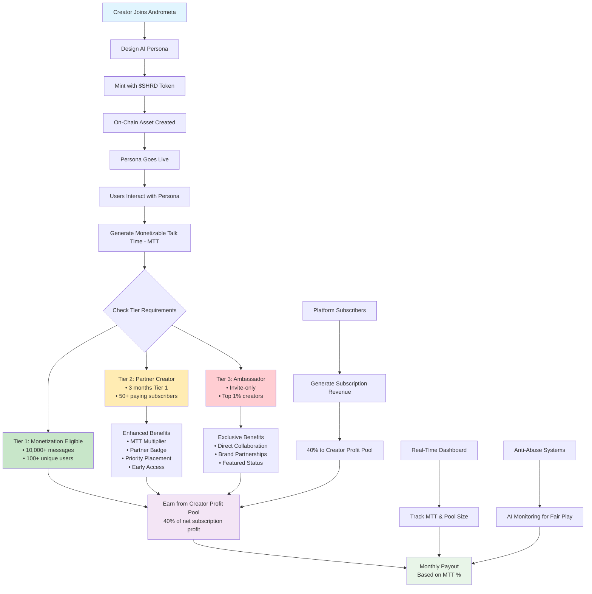

# The Andrometa Creator Economy

## Our Philosophy: A True Partnership

The Andrometa Creator Economy is built on a simple, powerful philosophy: our creators are our partners. We believe that the creators who make our ecosystem engaging and valuable should share directly and transparently in the success they help generate.

Our model is not a simple revenue share; it's a profit-sharing partnership. We've designed a sustainable economic engine where the platform's success is intrinsically linked to the success of our creators.

## How It Works: Two Paths to Monetization

We offer two distinct funnels for creators to participate and earn.

### 1. The AI Persona Ecosystem (Platform UGC)

This path is for creators who want to build and contribute to the core experience of our AI-driven social platform.

**Create & Mint:** Creators design unique, agentic AI personalities with distinct traits and behaviors. Using the $SHRD token, these personas are minted as on-chain assets, giving the creator verifiable ownership.

**Earn from Engagement:** Creators earn a share of the "Creator Profit Pool" based on the engagement their AI personas generate. This is measured by Monetizable Talk Time (MTT)—the total number of messages a creator's persona receives from paying subscribers.

## The Financial Engine: The Creator Profit Pool

At the heart of our AI Persona Ecosystem is the Creator Profit Pool.

**Funding:** Andrometa allocates 40% of the net subscription profit from all tiers into this monthly pool.

**Payouts:** Your share of the pool is calculated based on your percentage of the total MTT on the platform for that month.

This profit-sharing model ensures our creator program is always sustainable and that creator payouts scale directly with the platform's financial success.

## The Creator Tiers: A Path to Growth

We have designed a tiered system to reward dedication and quality, providing a clear path for advancement within the ecosystem.

### Tier 1: Monetization Eligible
The entry point for creators to begin earning from their AI personas.

**Requirements:** A persona must receive at least 10,000 messages from a minimum of 100 unique users to prove initial quality and engagement.

**Benefits:** Eligible to earn a share of the Creator Pool based on their MTT.

### Tier 2: Partner Creator
This tier recognizes consistent, high-value creators.

**Requirements:** Maintain Tier 1 status for 3 consecutive months AND have personas engaged by at least 50 unique paying subscribers.

**Benefits:**
- Increased Profit Share: Receive a multiplier on their MTT contribution.
- Platform Visibility: A "Partner" badge and priority placement on discovery pages.
- Early Access: First access to new platform features and beta tests.
- Priority Support.

### Tier 3: Ambassador
The most exclusive, invite-only tier for our top creators.

**Requirements:** Invite-only, offered to the top ~1% of Partner Creators who show exceptional quality and community leadership.

**Benefits:**
- Direct Collaboration: Opportunities to work with the Andrometa team on new IP and licensed personas.
- Exclusive Revenue Opportunities: Access to brand partnership deals and special projects.
- Featured Status across Andrometa's marketing channels.

## Creator Economy Flow

## Transparency and Fair Play

To ensure a fair and trustworthy ecosystem, we are committed to:

**A Real-Time Dashboard:** Creators will have access to a dashboard to track their message thresholds, MTT, and the current estimated Creator Pool size, refreshed every 24 hours.

**Robust Anti-Abuse Systems:** We will deploy sophisticated, AI-driven monitoring to detect bot-like behavior and prevent metric "farming," ensuring that the Creator Pool is distributed fairly to those creating genuine engagement.

---

*The Andrometa Creator Economy represents a new paradigm in digital content creation—where AI personas become valuable assets and creator success is directly tied to platform growth.*
