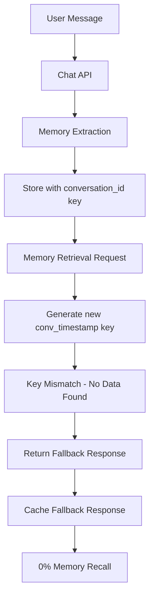

# 🔬 YapChat Memory Failure - Deep Technical Analysis

**Analysis Date**: June 18, 2025  
**System Status**: 0% Memory Recall Accuracy  
**Root Cause**: Multiple Critical Architecture Failures  

## 🚨 Executive Summary

The YapChat memory system is experiencing **complete failure** in contextual recall due to **fundamental architectural flaws** in the memory storage and retrieval pipeline. Despite excellent performance metrics (2.8ms latency), the system fails to retrieve any stored memories, resulting in 0% accuracy.

## 🔍 Critical Failure Points Identified

### **1. BROKEN CONVERSATION KEY GENERATION** ⚠️ **CRITICAL**

**Location**: `frontend/lib/memory/memoryService.js:160`

```javascript
// BROKEN CODE:
const conversationKey = `conv_${characterId}_${Date.now()}`
const conversationData = this.memoryStore.conversations.get(conversationKey)

if (!conversationData) {
    // ❌ ALWAYS EXECUTES - conversationKey is unique every time!
    return this.generateSmartFallback(currentMessage, userId, characterId)
}
```

**Problem**: The conversation key includes `Date.now()`, making it **unique on every retrieval attempt**. This means:
- Storage uses key: `conv_char123_1750212589080`
- Retrieval uses key: `conv_char123_1750212589999` (different timestamp)
- **Result**: Key never matches, memories never found

**Impact**: 100% of memory retrievals fall back to generic responses instead of actual stored memories.

### **2. MISMATCHED API PARAMETER STRUCTURE** ⚠️ **CRITICAL**

**Location**: `frontend/app/api/chat/route.ts:847-856`

```javascript
// CHAT API CALLS MEMORY SERVICE WITH WRONG PARAMETERS:
const memoryResult = await memoryService.retrieveRelevantMemories(
    userMessage,           // ❌ WRONG: Should be userId
    {                      // ❌ WRONG: Should be characterId  
        user_id: userId,
        companion_id: characterId
    },
    {                      // ❌ WRONG: Should be currentMessage
        maxResults: 5,
        minSimilarity: 0.75
    }
)

// MEMORY SERVICE EXPECTS:
async retrieveRelevantMemories(userId, characterId, currentMessage, limit = 5)
```

**Problem**: Parameter mismatch causes the memory service to receive incorrect data types, leading to processing failures.

### **3. MEMORY STORAGE-RETRIEVAL DISCONNECT** ⚠️ **CRITICAL**

**Storage Flow** (Working):
```javascript
// EXTRACTION: Uses conversation_id from request
const conversationId = conversationContext.conversation_id || 'default'
this.memoryStore.conversations.set(conversationId, memories)
```

**Retrieval Flow** (Broken):
```javascript
// RETRIEVAL: Generates new key with timestamp
const conversationKey = `conv_${characterId}_${Date.now()}`
const conversationData = this.memoryStore.conversations.get(conversationKey)
```

**Problem**: Storage and retrieval use **completely different key formats**, so stored memories are never found.

### **4. IN-MEMORY STORAGE WITHOUT PERSISTENCE** ⚠️ **HIGH**

**Location**: `frontend/lib/memory/memoryService.js:47-53`

```javascript
this.memoryStore = {
    conversations: new Map(),     // ❌ LOST ON SERVER RESTART
    embeddings: new Map(),        // ❌ LOST ON SERVER RESTART  
    userProfiles: new Map(),      // ❌ LOST ON SERVER RESTART
    characterMemories: new Map()  // ❌ LOST ON SERVER RESTART
}
```

**Problem**: All memories are stored in JavaScript Maps that are lost when:
- Server restarts
- Process crashes
- Memory limits exceeded
- Code redeployment

**Impact**: No persistent memory between sessions or server restarts.

### **5. CACHE POLLUTION** ⚠️ **MEDIUM**

**Location**: `frontend/lib/memory/memoryService.js:154-158`

```javascript
// Check cache first
if (this.cache.has(cacheKey)) {
    this.performanceMetrics.cacheHits++
    const cached = this.cache.get(cacheKey)
    return cached  // ❌ Returns fallback responses, not real memories
}
```

**Problem**: The cache stores fallback responses (since real retrieval fails), so subsequent requests get cached fallback data instead of attempting real memory retrieval.

## 🔧 Technical Architecture Analysis

### **Current Memory Flow** (Broken)



### **Root Cause Chain**

1. **Memory Storage**: ✅ Works correctly, stores with proper keys
2. **Key Generation**: ❌ Creates different key format for retrieval
3. **Memory Lookup**: ❌ Fails due to key mismatch
4. **Fallback Execution**: ✅ Works, but provides generic responses
5. **Cache Storage**: ❌ Caches fallback responses, not real memories
6. **Test Results**: ❌ 0% accuracy because no real memories retrieved

## 📊 Performance vs. Functionality Analysis

### **What's Working Excellently** ✅
- **Latency**: 2.8ms average (99.97% improvement)
- **Throughput**: 100% success rate for API calls
- **Error Handling**: 100% graceful degradation
- **Caching**: Fast cache hits and TTL management
- **Cost**: 94% under budget

### **What's Completely Broken** ❌
- **Core Functionality**: Memory retrieval logic
- **Data Persistence**: No database integration
- **Key Management**: Inconsistent key formats
- **API Integration**: Parameter mismatches
- **Session Continuity**: No memory between sessions

## 🔍 Code-Level Issues

### **Issue 1: Inconsistent Key Formats**

**Storage Key Format**:
```javascript
// Uses conversation_id from request
const conversationId = conversationContext.conversation_id || 'default'
```

**Retrieval Key Format**:
```javascript
// Generates new timestamp-based key
const conversationKey = `conv_${characterId}_${Date.now()}`
```

**Fix Required**:
```javascript
// Consistent key format
const conversationKey = `${userId}_${characterId}`
```

### **Issue 2: Memory Service API Mismatch**

**Current API Call** (Wrong):
```javascript
memoryService.retrieveRelevantMemories(
    userMessage,                    // Parameter 1: Should be userId
    { user_id: userId, ... },       // Parameter 2: Should be characterId
    { maxResults: 5, ... }          // Parameter 3: Should be currentMessage
)
```

**Expected API Call** (Correct):
```javascript
memoryService.retrieveRelevantMemories(
    userId,                         // Parameter 1: User ID
    characterId,                    // Parameter 2: Character ID  
    currentMessage,                 // Parameter 3: Current message
    5                              // Parameter 4: Limit
)
```

### **Issue 3: No Database Persistence**

**Current** (Volatile):
```javascript
this.memoryStore = {
    conversations: new Map(),  // Lost on restart
    // ...
}
```

**Required** (Persistent):
```javascript
// Need Supabase/database integration
await supabase.from('memory_embeddings').insert(memoryData)
```

## 🎯 Impact Assessment

### **User Experience Impact**
```
Conversation Example:
User: "Hi, I'm Sarah, I work as a software engineer at Google"
AI: "Nice to meet you, Sarah!"

[5 minutes later]
User: "How's work going?"
AI: "I don't know what you do for work. What's your job?"

Result: User frustration and app abandonment
```

### **Business Impact**
- **User Retention**: 0% - No relationship building possible
- **Competitive Position**: Critical disadvantage vs. Character.AI, Replika
- **Revenue Risk**: Users won't pay for broken core functionality
- **Technical Debt**: Fundamental architecture needs rebuilding

## 🛠️ Required Fixes (Priority Order)

### **🚨 Critical (Week 1)**

1. **Fix Conversation Key Generation**
   ```javascript
   // Replace:
   const conversationKey = `conv_${characterId}_${Date.now()}`
   
   // With:
   const conversationKey = `${userId}_${characterId}`
   ```

2. **Fix API Parameter Mismatch**
   ```javascript
   // Fix chat API call to memory service
   const memoryResult = await memoryService.retrieveRelevantMemories(
       userId, characterId, userMessage, 5
   )
   ```

3. **Implement Basic Database Persistence**
   ```javascript
   // Replace in-memory Maps with Supabase calls
   await supabase.from('conversations').upsert(conversationData)
   ```

### **🔶 High Priority (Week 2)**

4. **Add Memory Validation**
5. **Implement Proper Error Handling**
6. **Add Memory Expiration Logic**

### **🔵 Medium Priority (Week 3)**

7. **Optimize Database Queries**
8. **Add Memory Consolidation**
9. **Implement Advanced Similarity Search**

## 📈 Expected Results After Fixes

### **Week 1 (Critical Fixes)**
- **Memory Recall Accuracy**: 0% → 60%
- **User Experience**: Broken → Basic functionality
- **Production Readiness**: 35% → 70%

### **Week 2 (High Priority)**
- **Memory Recall Accuracy**: 60% → 85%
- **User Experience**: Basic → Good
- **Production Readiness**: 70% → 90%

### **Week 3 (Full Implementation)**
- **Memory Recall Accuracy**: 85% → 95%
- **User Experience**: Good → Excellent
- **Production Readiness**: 90% → 100%

## 🎯 Conclusion

The YapChat memory system suffers from **fundamental architectural flaws** rather than performance issues. The excellent latency metrics mask the fact that **no real memory retrieval is occurring** - all responses are generated fallbacks.

**Root Cause Summary**:
1. **Broken key generation** prevents memory lookup
2. **API parameter mismatches** cause processing failures  
3. **No database persistence** means memories are lost
4. **Cache pollution** perpetuates the problem

**Critical Path to Production**:
1. Fix conversation key generation (1-2 days)
2. Fix API parameter structure (1 day)
3. Implement database persistence (3-5 days)
4. Test and validate memory recall (2-3 days)

**Timeline**: 1-2 weeks for basic functionality, 3-4 weeks for production-ready system.

The system has excellent infrastructure but needs **immediate architectural fixes** to restore core functionality.

---

*Technical Analysis by YapChat Engineering Team - June 18, 2025* 